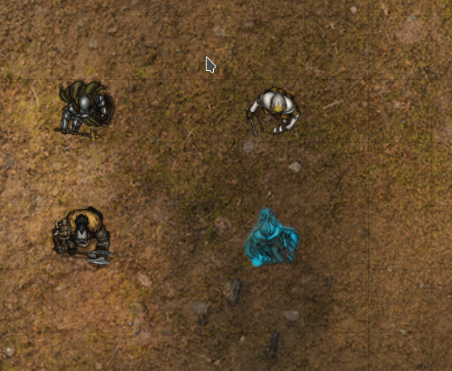

# Multi Token Status for Foundry

Multi Token Status is a Foundry VTT module that allows you to add and remove token statuses on multiple tokens at once.

When adding a status to a token, that status will be added to all currently selected tokens.

Similarly, when removing a status from a token, that status will be removed from all currently selected tokens.

## System Compatibility
Multi Token Status has been tested and verified working with the following systems...
* Age of Sigmar: Soulbound (`age-of-sigmar-soulbound`)
* Dungeons & Dragons v3.5 (`D35E`) *
* Dungeons & Dragons 5th Edition (`dnd5e`)
* GURPS 4e Game Aid (`gurps`)
* Pathfinder 1st Edition (`pf1`) *
* Pathfinder 2nd Edition (`pf2e`)
* Simple Worldbuilding (`worldbuilding`)
* Savage Worlds Adventure Edition (`swade`)

*\* Note that "Buffs" in D&D 3.5 and PF1e will only trigger for a single token*

Other systems may work if they do not greatly alter the way token statuses work.  Any extra extra buttons that get added the end of the status list (e.g. "Buffs" in D&D 3.5 / PF1e) may still only trigger for a single token at a time.

## Module Compatibility
This module may not behave correctly with any other module that changes status effects, such as [FoundryVTT Status Icon Counters](https://gitlab.com/woodentavern/status-icon-counters).

### DFred's Convenient Effects
This module is compatible with [DFred's Convernient Effects](https://github.com/DFreds/dfreds-convenient-effects), however you should prioritize this module over DFred's in the libWrapper settings.  To do that, open the Settings in Foundy, then navigate to the libWrapper settings, then click the "libWrapper Settings Menu" button.  In the "Unprioritized Packages" section, find and select "Multi Token Status" and then click the up arrow between the "Prioritized Packages" and "Unprioritized Packages".  This will move Multi Token Status to the Prioritized Packages section.  Click "Save", and then re-load the game when prompted.

## Installation
Multi Token Status can be installed using the Foundry module installer.  Alternatively, you can install it using the following manifest URL... 
https://github.com/cs96and/FoundryVTT-multistatus/releases/latest/download/module.json

## Support Me
If you find this module useful and would like to offer your support, why not buy me a coffee (or a beer)?

